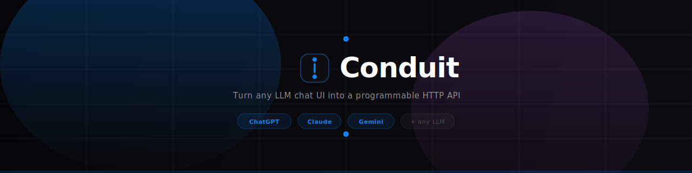

<div align="center">
  

  <br/>

  [](https://python.org)
  [](https://fastapi.tiangolo.com)
  [](https://developer.chrome.com/docs/extensions/mv3/)
  [](LICENSE)
  [](CONTRIBUTING.md)

  <br/>

  <p align="center">
    <b>Conduit turns ChatGPT, Claude, and Gemini into a local HTTP API — no scraping, no unofficial wrappers, no rate-limit games.</b><br/>
    A Chrome extension bridges your authenticated browser session to a FastAPI backend. One <code>POST /v1/chat</code> and you get the full response, including generated images, back as JSON.
  </p>

  <br/>

</div>

---

## ✦ Why Conduit

| Problem | Solution |
|---|---|
| Official APIs cost money per token | Conduit uses your existing paid/free browser session |
| Web UIs can't be automated | Conduit speaks to the UI exactly as a human would |
| Image generation has no API | Conduit captures Imagen/DALL·E output as base64 + a short URL |
| Different UIs, different DOM structures | Self-healing selector engine with LLM calibration fallback |
| One-off scripts feel brittle | 7-strategy response capture + MutationObserver completion detection |

---

## ✦ Features

- **Universal provider support** — ChatGPT (chat.openai.com / chatgpt.com), Claude (claude.ai), Gemini (gemini.google.com)
- **Image generation capture** — Gemini Imagen and ChatGPT DALL·E output returned as `image_urls` (short localhost links) or raw base64
- **Web search toggle** — enable/disable a provider's built-in web search per request
- **Self-healing selectors** — 4-rung ladder: in-memory cache → adapter defaults → stable anchors → LLM calibration. Survives UI redesigns.
- **MutationObserver completion detection** — reacts the instant the stop button disappears, no polling loops
- **Exponential backoff reconnect** — 1 s → 2 s → 4 s … 30 s cap; extension reconnects automatically across backend restarts
- **Serial prompt queue** — multiple callers queued cleanly; no race conditions
- **Short image URLs** — `GET /v1/images/<id>` serves the image directly in a browser; persisted to disk across hot-reloads
- **OpenAI-compatible calibration** — works with Groq, Together, local Ollama, or any OpenAI-schema endpoint

---

## ✦ Architecture

```
┌─────────────────────────────────────────────────────────┐
│                    Your Code / curl                     │
│             POST http://localhost:8765/v1/chat          │
└───────────────────────────┬─────────────────────────────┘
                            │ HTTP
┌───────────────────────────▼─────────────────────────────┐
│               FastAPI Backend  (port 8765)              │
│  /v1/chat  /v1/calibrate  /v1/images/:id  /v1/providers │
└───────────────────────────┬─────────────────────────────┘
                            │ WebSocket  ws://localhost:8765/ws
┌───────────────────────────▼─────────────────────────────┐
│           Chrome Extension  (Conduit MV3)               │
│                                                         │
│  background.js (Service Worker)                         │
│    └─ owns the WebSocket connection to backend          │
│    └─ routes prompts to the correct tab                 │
│                                                         │
│  content.js  (Isolated World — per LLM tab)             │
│    └─ self-healing selector discovery                   │
│    └─ MutationObserver done-detection                   │
│    └─ 7-strategy response capture                       │
│    └─ snapshot-diff image detection                     │
│                                                         │
│  injector.js  (MAIN World — same JS context as the UI)  │
│    └─ React-safe text injection (execCommand / native)  │
│    └─ send-button click heuristics                      │
│    └─ canvas-based blob-URL image export                │
└─────────────────────────────────────────────────────────┘
                            │ DOM / CustomEvents
┌───────────────────────────▼─────────────────────────────┐
│         LLM Chat UI  (ChatGPT / Claude / Gemini)        │
└─────────────────────────────────────────────────────────┘
```

---

## ✦ Quick Start

### 1 — Backend

```bash
cd conduit/backend
python3.11 -m venv .venv && source .venv/bin/activate
pip install -r requirements.txt

# copy the env template and (optionally) add an LLM key for selector calibration
cp .env.example .env

python main.py
# → Uvicorn running on http://0.0.0.0:8765
```

### 2 — Extension

1. Open Chrome → `chrome://extensions`
2. Enable **Developer mode** (top right)
3. Click **Load unpacked** → select the `conduit/extension` folder
4. Pin the Conduit extension — the popup shows which providers are live

### 3 — Open a provider tab

Navigate to any supported URL while the extension is active:

| Provider | URL |
|---|---|
| ChatGPT | `https://chatgpt.com` |
| Claude | `https://claude.ai` |
| Gemini | `https://gemini.google.com` |

The popup status dot turns **blue / Live** within a few seconds.

### 4 — Send your first prompt

```bash
curl -s -X POST http://localhost:8765/v1/chat \
  -H "Content-Type: application/json" \
  -d '{"provider":"gemini","prompt":"Hello! What can you do?"}' \
  | python3 -m json.tool
```

```json
{
  "id": "a1b2c3d4-...",
  "provider": "gemini",
  "response": "I'm Gemini, Google's AI assistant...",
  "images": [],
  "image_urls": [],
  "status": "success"
}
```

---

## ✦ API Reference

### `POST /v1/chat`

Send a prompt to any connected provider.

**Request**

```json
{
  "provider": "gemini",
  "prompt": "Generate an image of a sunset over mountains",
  "timeout": 120,
  "web_search": false
}
```

| Field | Type | Default | Description |
|---|---|---|---|
| `provider` | `string` | — | `chatgpt` · `claude` · `gemini` |
| `prompt` | `string` | — | The message to send |
| `timeout` | `int` | `120` | Max seconds to wait for a response |
| `web_search` | `bool` | `false` | Toggle the provider's built-in web search |

**Response**

```json
{
  "id": "fd93cc20-4a43-4842-aed1-36a41869ae8f",
  "provider": "gemini",
  "response": "Creating your image",
  "images": ["data:image/jpeg;base64,/9j/4AAQ..."],
  "image_urls": ["http://localhost:8765/v1/images/a3f8c120"],
  "status": "success"
}
```

| Field | Description |
|---|---|
| `response` | Full assistant text (Markdown-stripped inner text) |
| `images` | Base64 data URLs — embed directly in `` or save to disk |
| `image_urls` | Short localhost URLs — open in any browser, no decoding needed |

---

### `GET /v1/images/:id`

Serve a previously generated image. The file is persisted to `/tmp/conduit_images/` and survives backend hot-reloads.

```bash
open http://localhost:8765/v1/images/a3f8c120
```

---

### `GET /v1/providers`

List all connected providers and their readiness state.

```json
{
  "providers": [
    { "id": "gemini", "ready": true },
    { "id": "claude", "ready": true }
  ]
}
```

---

### `POST /v1/calibrate`

Trigger an LLM-powered DOM calibration for a new or changed provider UI. Returns the full `SelectorSet` used by the extension.

```json
{
  "domain": "gemini.google.com",
  "dom_snapshot": "<compressed DOM string>"
}
```

> **Note:** The extension calls this automatically when its selector cache misses. You rarely need to call it manually.

---

## ✦ Image Generation

Conduit captures generated images from providers that support them, handling all the edge cases that make this hard:

| Challenge | How Conduit solves it |
|---|---|
| Gemini uses `blob:` URLs owned by the MAIN world | injector.js loads the blob into `Image()` and draws to canvas — no `fetch()`, no CSP violation |
| Image renders *after* the text response finishes | `pollForLateImages` mode polls up to 20 s when the text response is ≤ 200 chars |
| Avatar / UI icons pollute the image set | Before/after snapshot diff: only images that *appear after* the prompt is sent are captured |
| CORS blocks content-script fetch of CDN URLs | Routed through the background Service Worker (no CORS restrictions) |

**Example — Gemini Imagen:**

```bash
curl -s -X POST http://localhost:8765/v1/chat \
  -H "Content-Type: application/json" \
  -d '{"provider":"gemini","prompt":"Generate a photo of a neon Tokyo alley at night"}' \
  | python3 -c "import json,sys; r=json.load(sys.stdin); [print(u) for u in r['image_urls']]"

# http://localhost:8765/v1/images/3d7a9f01
```

---

## ✦ Configuration

Copy `conduit/backend/.env.example` to `.env`. All fields are optional unless you want LLM-powered selector calibration.

```dotenv
# Any OpenAI-compatible key — used only for selector calibration fallback
LLM_API_KEY=sk-...

# Override to use Groq, Together, local Ollama, etc.
LLM_BASE_URL=https://api.groq.com/openai/v1
LLM_MODEL=llama-3.3-70b-versatile
```

**Groq (free, fast):**
```dotenv
LLM_API_KEY=gsk_...
LLM_BASE_URL=https://api.groq.com/openai/v1
LLM_MODEL=llama-3.3-70b-versatile
```

**Local Ollama:**
```dotenv
LLM_API_KEY=ollama
LLM_BASE_URL=http://localhost:11434/v1
LLM_MODEL=mistral
```

> Calibration only runs when the built-in selector ladder fails (new provider, major UI update). Normal usage requires no API key.

---

## ✦ How the Selector Engine Works

Conduit never hardcodes a single brittle CSS selector. Instead it walks a 4-rung self-healing ladder:

```
1. In-memory cache          → instant, zero DOM access
        ↓ miss
2. Adapter defaults         → provider-specific known-good selectors
        ↓ miss
3. Stable anchor candidates → ~20 universal candidates tried in order
        ↓ miss
4. LLM calibration          → compressed DOM snapshot sent to your LLM
                               returns full SelectorSet in one call
                               result cached to chrome.storage.local
```

When the UI changes (e.g. ChatGPT ships a redesign), the cache entry is invalidated on first miss and the ladder re-runs — no extension update needed.

---

## ✦ Supported Providers

| Provider | Text | Images | Web Search | Notes |
|---|:---:|:---:|:---:|---|
| **ChatGPT** | ✅ | ✅ DALL·E | ✅ | chat.openai.com + chatgpt.com |
| **Claude** | ✅ | — | — | claude.ai |
| **Gemini** | ✅ | ✅ Imagen | ✅ | gemini.google.com |

---

## ✦ Project Structure

```
conduit/
├── backend/
│   ├── main.py           # FastAPI app — HTTP routes + WebSocket bridge
│   ├── calibration.py    # LLM-powered selector calibration (one call → full SelectorSet)
│   ├── models.py         # Pydantic models — SelectorSet, CalibrateRequest
│   ├── requirements.txt
│   └── .env.example
└── extension/
    ├── manifest.json     # Chrome MV3 manifest
    ├── background.js     # Service worker — WebSocket owner, prompt router
    ├── content.js        # Isolated world — selector engine, done-detection, image capture
    ├── injector.js       # MAIN world — React-safe injection, canvas blob export
    ├── popup.html        # Extension popup UI
    └── popup.js          # Popup logic — provider status, quick-copy curl
```

---

## ✦ Contributing

Pull requests are welcome. For large changes, open an issue first.

```bash
# Clone
git clone https://github.com/yourname/conduit.git
cd conduit

# Backend
cd backend && python3.11 -m venv .venv && source .venv/bin/activate && pip install -r requirements.txt

# Extension — load unpacked from conduit/extension in chrome://extensions
```

**Adding a new provider:**

1. Add an adapter entry in `content.js` → `ADAPTERS`
2. Add the host to `manifest.json` → `matches` and `host_permissions`
3. Add `captureResponse` strategies if the markup differs
4. Open a PR

---

## ✦ License

MIT — see [LICENSE](LICENSE).

---

<div align="center">
  <sub>Built with FastAPI · Chrome MV3 · WebSockets · Canvas API</sub>
  <br/>
  <sub>If Conduit saves you time, drop a ⭐ — it helps others find it.</sub>
</div>
